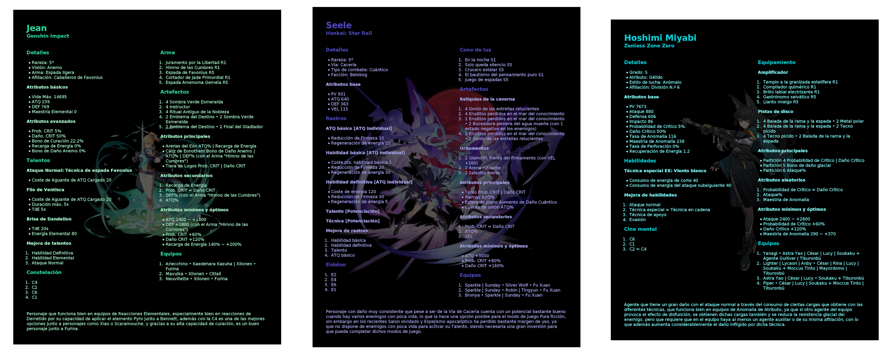
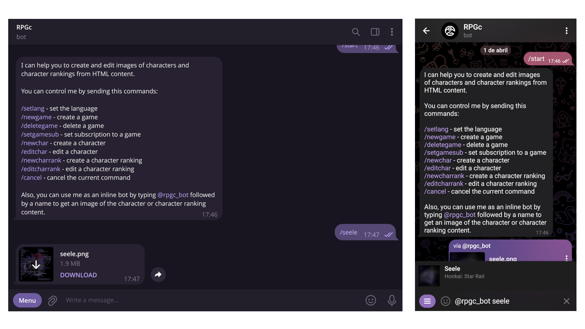

# RPGc

A [Telegram bot](https://core.telegram.org/bots/) to create and edit images of characters and character rankings from 
HTML content.

## How to use

In the Telegram app you can search for the [@rpgc_bot](https://t.me/rpgc_bot) account and open a chat with it and click 
the `Start` button, to start the bot as shown in the image below.

As you can see, the bot sends a message with instructions for use, where the commands indicated are for use by the 
administrator and editor, but also, as a normal user, you can use commands to get the images of the characters or 
character rankings, or use it as an inline bot.

## Build

This project uses [Gradle](https://gradle.org/) for build and dependency management.

To generate JAR packages run the following commands:

- Build Telegram bot application with `gradlew telegramBot:build`
- Build Discord bot application with `gradlew discordBot:build`
- Build API application with `gradlew api:build`
- Download H2 database tools with `gradlew tools:downloadH2Jar`

## Deployment

This project uses [Docker](https://www.docker.com/) for deployment.

To manage services run the following commands:

- Build and start services with `docker compose up -d --build`
- Stop and terminate services with `docker compose down`